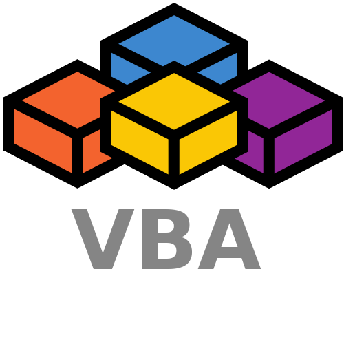

<h1 align="center"> Hey I'am ELREKO </h1>

## I am a Student at [42 berlin](https://42berlin.de/)👨🏻‍💻📚

---
<h2 align="left"><a href="Projectoverview.md"> ▶️  Solved Projects</a></h2>

Prior to starting my studies at 42, I spent eight years in systems programming and commissioning. Details about the companies I worked for and my career progression can be found on my [Xing](https://www.xing.com/profile/Rene_Kost3/web_profiles?sc_o=navigation_profile_icon&sc_o_PropActionOrigin=navigation_neffi_100&expandNeffi=true) Profil.

<h2 align="center"> Tech Stack </h2>
<h3>software development skills</h3>

### Frontend
 

### Backend

### Others 

<h3>plant programming skills</h3>

<!--
**ELREKO/ELREKO** is a ✨ _special_ ✨ repository because its `README.md` (this file) appears on your GitHub profile.

Here are some ideas to get you started:

- 🔭 I’m currently working on ...
- 🌱 I’m currently learning ...
- 👯 I’m looking to collaborate on ...
- 🤔 I’m looking for help with ...
- 💬 Ask me about ...
- 📫 How to reach me: ...
- 😄 Pronouns: ...
- ⚡ Fun fact: ...
-->
